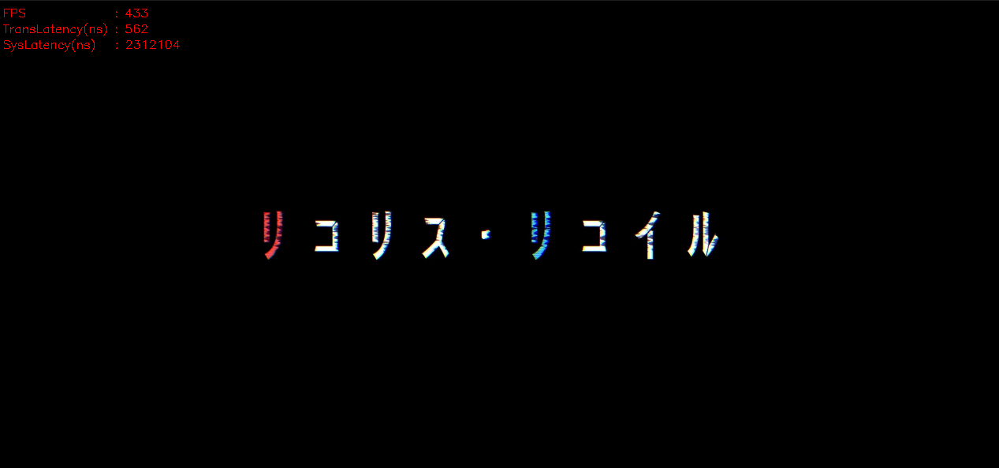

# shm_video_transmission

基于boost的超轻量进程间视频传输组件，延迟优先，适用于CV_8UC3格式图像



## 注意

【!】调用send函数会更改输入图像大小

【!】大小固定方式为RESIZE

【!】同一Channel允许存在一个发送者和多个接收者

【!】默认情况下同一Channel的发送者如果关闭，所有接收者需要重新打开

【!】sender默认写入超时时间为1s，超时后将重置进程锁，receiver需要在超时后重新打开

【!】Share模式下receiver对图像的修改会同步至其他receiver，Copy模式下不影响但会增加延迟

## 使用

### 依赖

opencv4.5.0+

boost

pthread

### Demo编译

```
mkdir build
cd build
cmake ..
make
```

### Demo发送者

```
./sender <channelName> <width> <height> <videoFilePath>
```

### Demo接收者

```
./receiver <channelName>
```

## 开发

### 发送方

```
#include "./SHM_Video_Transmission/shm_video_transmission.h"
...
shm_video_trans::VideoSender sender(channelName, width, height); // 创建发送者 <通道名> <发送视频图像的宽> <发送视频图像的高>
sender.disableAutoRemove() // 【可选】 禁用析构时释放共享内存 【默认开启】
sender.enableAutoRemove() // 【可选】 启用析构时释放共享内存 【默认开启】
sender.setTimeoutPeriod(int t) // 【可选】 设置解锁超时时间（ms） <超时时间> 【默认1000】
cv::Mat frame;
while(...)
{
	std::chrono::_V2::system_clock::time_point collect_time = std::chrono::_V2::system_clock::now(); // 标记图像采集时间
	frame = ... // 准备发送图像 【CV_8UC3 ONLY】
	...
	sender.send(frame, collect_time); // 发送图像 <图像> <用户输入时间>
	...
}
...
sender.release_channel() // 【可选】 非自动模式下释放共享内存
...
```

### 接收方

```
#include "./SHM_Video_Transmission/shm_video_transmission.h"
...
shm_video_trans::VideoReceiver receiver(channelName); // 创建接收者 <通道名>
while (!receiver.init()) // 初始化接收者 && 等待发送者准备完成
{
        std::this_thread::sleep_for(std::chrono::milliseconds(10));
}
shm_video_trans::FrameBag receivedFrame; // 创建接收结构体
while(...)
{
	...
	if(receiver.receive()) // 尝试接收图像
	{
		receiver.lock(); // 为资源上锁防止写入覆盖
		receivedFrame = receiver.toCvShare(); // 零拷贝方式接收
		receivedFrame = receiver.toCvCopy(); // 【可选】 拷贝式接收
		...
		// 对资源进行一些操作
		...
		receiver.unlock(); // 为资源解锁以允许发送者继续
	}
	...
}
...
```

### 接收结构体阐述

```
struct FrameBag
{
        high_resolution_clock::time_point time_stamp; // 用户写入图像采集时间
        high_resolution_clock::time_point write_time; // 发送者写入图像实际发送时间
        Mat frame; // 图像数据
};
```
